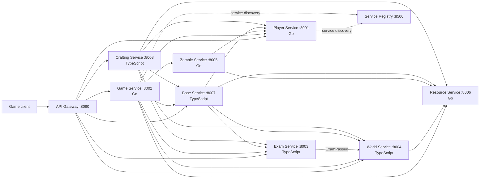

# System Architecture

The CPR is the public contract repository. Each service owns one domain and its private database;
services communicate through versioned HTTP APIs and selected domain events. The Game Service is
the runtime coordinator, while Player Service issues tokens and Resource Service is the atomic
resource write hub.

## Runtime rules

- Every service owns its own PostgreSQL database; no service reads another service's tables.
- REST uses `/api/v1/`; WebSocket sessions use `/ws/v1/`.
- Player Service issues RS256 player tokens. Other services validate them using Player JWKS.
- Cross-service writes use service tokens and an `Idempotency-Key`.
- `ExamPassed` is the event that unlocks new World wings.
- Game owns timers and orchestration, but not map, inventory, resource, or zombie truth.

See the [full communication contract](../README.md#communication-contract) for payloads,
responses, errors, and data models.